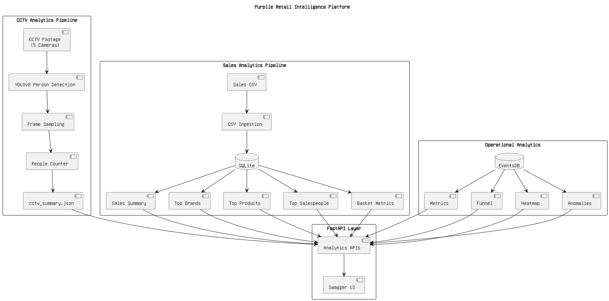
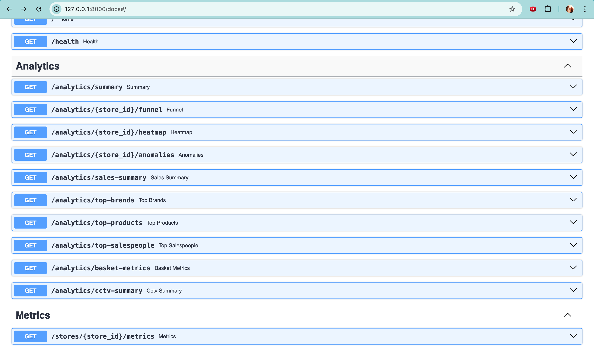
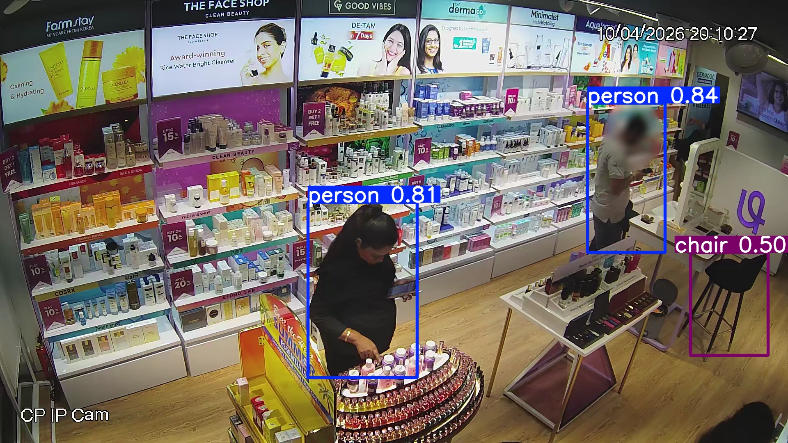

# Purplle Retail Intelligence Platform

## Overview

This project implements a retail intelligence platform for Purplle stores using CCTV video analytics and transaction analytics.

The system processes CCTV footage to estimate visitor activity and combines it with POS transaction data to generate actionable retail insights.

The solution exposes analytics through FastAPI endpoints and stores processed data in SQLite.

---

## Features

### CCTV Analytics

* Person Detection using YOLOv8
* Footfall Estimation
* Camera-wise Occupancy Analysis
* CCTV Summary Generation

### Retail Analytics

* Sales Summary
* Top Brands
* Top Products
* Top Salespeople
* Basket Metrics

### Operational Analytics

* Funnel Analytics
* Heatmap Analytics
* Anomaly Detection
* Store Metrics

---
## System Architecture



## Technology Stack

* Python 3.12
* FastAPI
* SQLite
* Pandas
* OpenCV
* YOLOv8 (Ultralytics)

---

## Project Structure

```text
app/
├── api/
├── database/
├── models/
├── services/

pipeline/
├── csv_ingest.py
├── detect.py
├── count_people.py

data/
videos/

docs/
├── DESIGN.md
├── CHOICES.md
├── ASSUMPTIONS.md
```

---

## Setup

```bash
pip install -r requirements.txt
```

Start API:

```bash
uvicorn main:app --reload
```

Swagger UI:

```text
http://127.0.0.1:8000/docs
```

---

## Running Sales Analytics

```bash
python pipeline/csv_ingest.py
```

---

## Running CCTV Analytics

```bash
python pipeline/count_people.py
```

This generates:

```text
data/cctv_summary.json
```

---

## Available APIs

### Event APIs

POST /events/ingest

### Metrics APIs

GET /stores/{store_id}/metrics

### Analytics APIs

GET /analytics/{store_id}/funnel

GET /analytics/{store_id}/heatmap

GET /analytics/{store_id}/anomalies

GET /analytics/sales-summary

GET /analytics/top-brands

GET /analytics/top-products

GET /analytics/top-salespeople

GET /analytics/basket-metrics

GET /analytics/cctv-summary

---

## Future Improvements

* Multi-camera visitor tracking
* Visitor re-identification
* Real-time event streaming
* Queue monitoring
* Shelf engagement analytics
* Cross-camera journey analytics
## Swagger UI



## YOLO Detection

